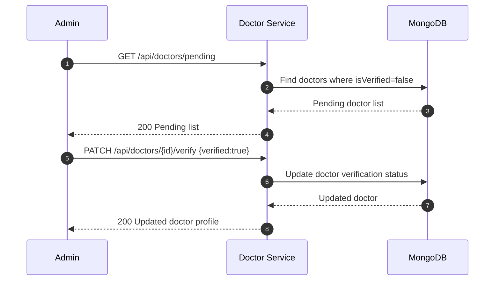
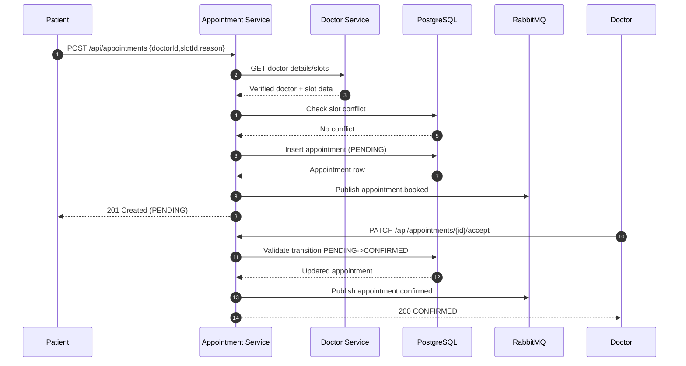
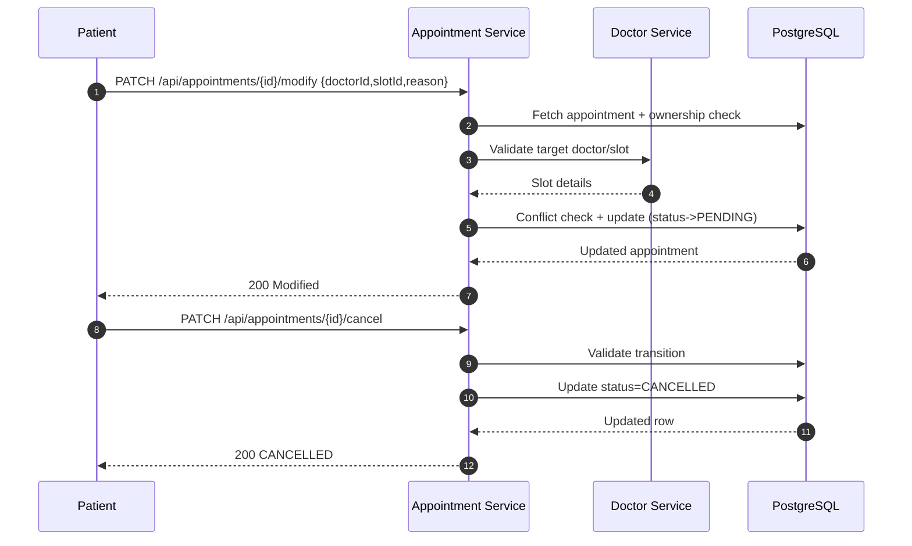
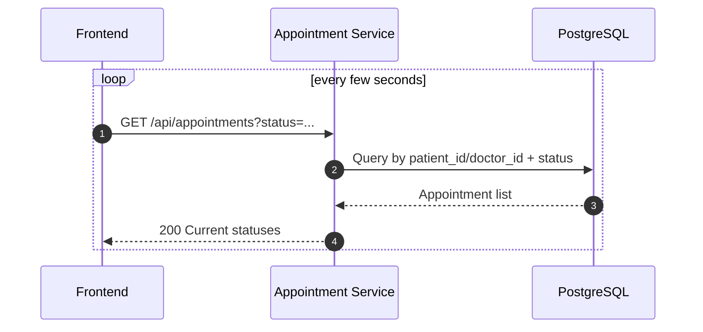

# Member 2 Contribution Report

## Scope
- Doctor Management Service
- Appointment Service
- Admin API endpoints relevant to Doctor and Appointment domains
- PostgreSQL appointment schema
- Unit tests for Doctor and Appointment services
- API documentation deliverables

## Service Interface List

### Doctor Service (Port 3003)
- `GET /health`
- `GET /api/doctors` (public, supports `?specialty=`)
- `GET /api/doctors/:id` (public)
- `GET /api/doctors/profile` (doctor)
- `PUT /api/doctors/profile` (doctor)
- `GET /api/doctors/schedule` (doctor)
- `POST /api/doctors/schedule` (doctor)
- `DELETE /api/doctors/schedule/:slotId` (doctor)
- `GET /api/doctors/prescriptions` (doctor)
- `POST /api/doctors/prescriptions` (doctor)
- `GET /api/doctors/patients/:patientId/reports` (doctor)
- `GET /api/doctors/pending` (admin)
- `PATCH /api/doctors/:id/verify` (admin)

### Appointment Service (Port 3004)
- `GET /health`
- `GET /api/appointments` (patient/doctor, polling support for real-time status)
- `GET /api/appointments/:id` (patient/doctor/admin)
- `POST /api/appointments` (patient)
- `PATCH /api/appointments/:id/modify` (patient)
- `PATCH /api/appointments/:id/cancel` (patient)
- `PATCH /api/appointments/:id/accept` (doctor)
- `PATCH /api/appointments/:id/reject` (doctor)
- `PATCH /api/appointments/:id/complete` (doctor)
- `GET /api/appointments/admin/all` (admin)
- `PATCH /api/appointments/:id/pay` (internal)
- `PATCH /api/appointments/:id/start` (internal)
- `POST /api/appointments/:id/prescription-issued` (internal)

### Related Admin API Endpoints (Cross-service)
- Doctor verification: `PATCH /api/doctors/:id/verify`
- Manage users: `GET /api/auth/users`, `PATCH /api/auth/users/:id/verify`, `PATCH /api/auth/users/:id/deactivate`
- View transactions: `GET /api/payments/admin/all`

## Workflow Sequence Diagrams

### 1) Doctor Verification Workflow

### 2) Appointment Booking + Confirmation Workflow

### 3) Appointment Modify + Cancel Workflow

### 4) Appointment Status Polling Workflow

## PostgreSQL Schema (Appointments)
- Defined in `db-scripts/postgres-init.sql`
- Table: `appointments`
- Core columns: `id`, `patient_id`, `doctor_id`, `slot_id`, `reason`, `status`, `rejection_reason`, `scheduled_at`, `created_at`, `updated_at`
- Indexes: `idx_app_patient`, `idx_app_doctor`, `idx_app_status`, `idx_app_slot`
- Trigger function updates `updated_at` automatically

## Unit Test Coverage
- Appointment Service: booking and transition tests in `appointment-service/src/__tests__/appointment.test.ts`
- Doctor Service: profile, prescription, and admin verification tests in `doctor-service/src/__tests__/doctor.test.ts`

## API Docs Deliverable
- Doctor docs: `http://localhost:3003/api-docs` and `/api-docs.json`
- Appointment docs: `http://localhost:3004/api-docs` and `/api-docs.json`
- Swagger specs are maintained in `doctor-service/src/swagger.ts` and `appointment-service/src/swagger.ts`
